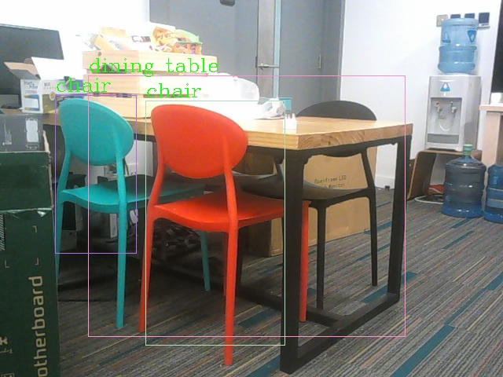

1. Run demo.cpp on x86 unbuntu, make sure opencv and bazel is installed.
    1. Build libtensorflowlite.so, under the tensorflow directory.
    ```
                bazel build -c opt //tensorflow/lite:libtensorflowlite.so --fat_apk_cpu=arm64-v8a
    ```
    2. Move .so to tensorflow_object_detection_tflite/lib
    3. Change find_library(TFLITE_LIBRARY tensorflow-lite "lib") to find_library(TFLITE_LIBRARY tensorflowlite "lib") in CMakeLists.txt
    4. Build cmake
    ```
            mkdir build
            cd build
            cmake ..
            make -j
            ./demo
    ```
2. Run demo.cpp on arm64-v8a.
    1. Build libtensorflow-lite.a, followed by the tensorflow tutorial https://www.tensorflow.org/lite/guide/build_arm64. Careful about the arm version, v7 or v8.
    2. Move .a to tensorflow_object_detection_tflite/lib
    3. keep find_library(TFLITE_LIBRARY tensorflow-lite "lib") unchanged.
    4. Build cmake
    ```
            mkdir build
            cd build
            cmake ..
            make -j
            ./demo
    ```
3. if there is flatbuffers error, build it in your desktop, and use its header files and .a lib file, you can check here to now how to build. https://github.com/google/flatbuffers/issues/5569#issuecomment-543777629

4. Result image



